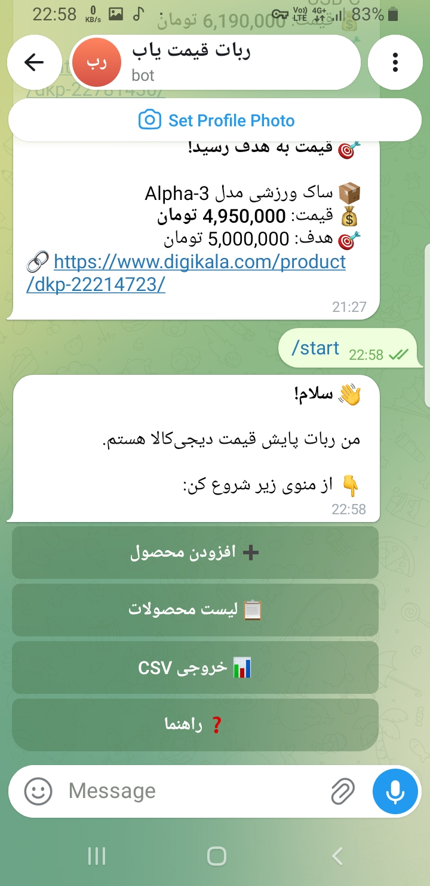
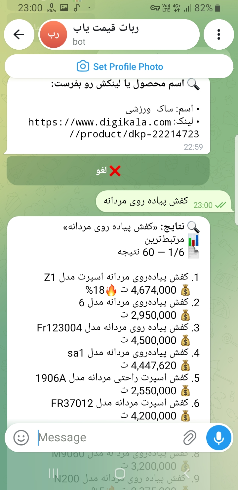
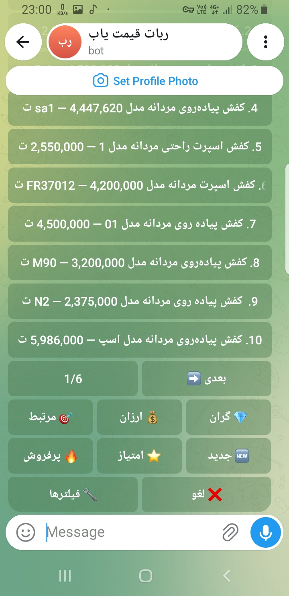
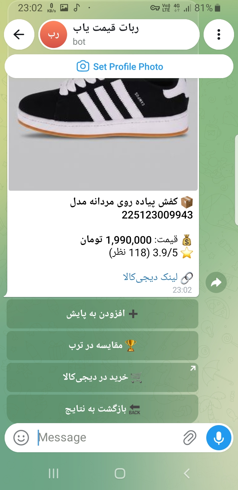
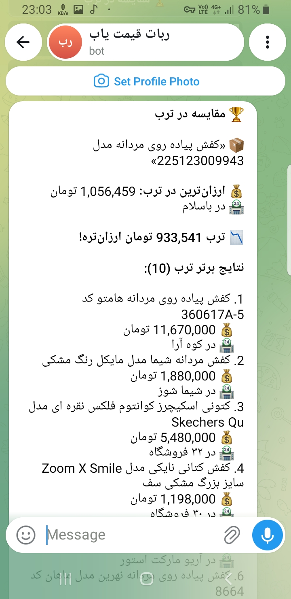
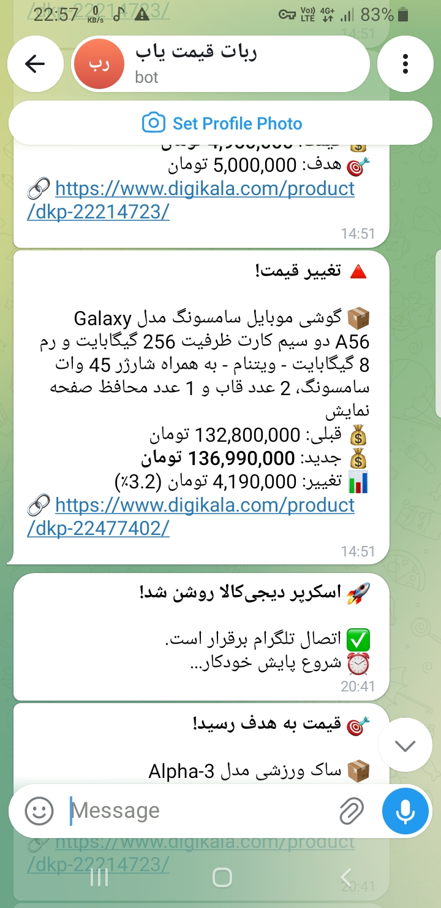
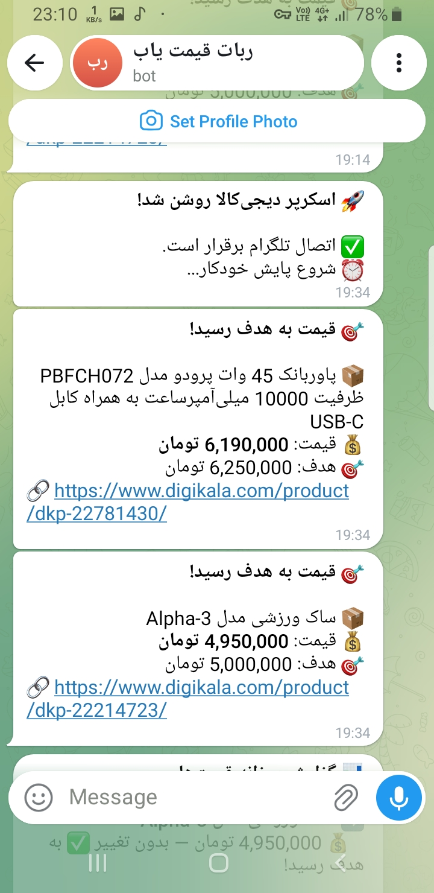
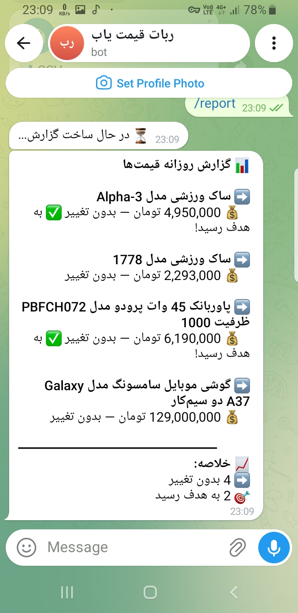
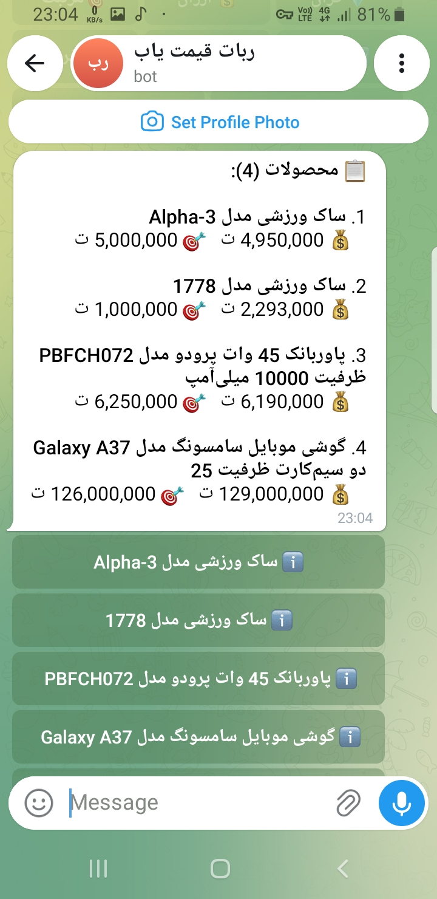
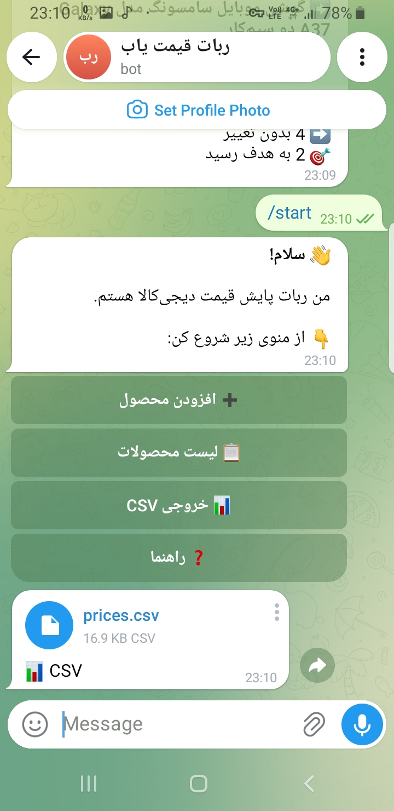

# 🎬 دموی ربات پایش قیمت دیجی‌کالا

## 🎥 ویدیو معرفی

> 📺 ویدیو ۴۵ ثانیه‌ای از کار ربات

---

## 📸 تصاویر

### ۱. منوی اصلی

ربات با منوی دکمه‌ای ساده شروع می‌شه.

### ۲. جستجوی محصول

کافیه اسم محصول رو بفرستی، ربات ۶۰ محصول مرتبط رو می‌آره.

### ۳. مرتب‌سازی و فیلتر

می‌تونی بر اساس قیمت، امتیاز، تخفیف و موجودی فیلتر کنی.

### ۴. صفحه جزئیات محصول

عکس، قیمت، امتیاز، و دکمه خرید مستقیم.

### ۵. مقایسه با ترب 🏆

همین محصول رو توی ترب هم جستجو می‌کنه و ارزان‌ترین قیمت رو نشون می‌ده.

### ۶. هشدار تغییر قیمت

هر تغییری توی قیمت رقیب، فوراً توی تلگرام بهت خبر می‌ده.

### ۷. رسیدن به قیمت هدف

قیمت هدف تعیین کن، وقتی محصول بهش رسید، خبر می‌دی.

### ۸. گزارش روزانه

هر شب ساعت ۲۱، خلاصه همه محصولات و تغییراتشون رو برات می‌فرسته.

### ۹. لیست محصولات

همه محصولات با قیمت فعلی و هدف، توی یه نگاه.

### ۱۰. خروجی CSV

دریافت فایل اکسل از همه تاریخچه قیمت‌ها.

---

## 🚀 امتحان کن

می‌خوای ربات رو برای خودت ببینی؟ [پیام بده](https://t.me/newdigikalascraperbot) تا دموی زنده بگیر.

---

## 💰 تعرفه

| پلن | تعداد محصول | قیمت |
|-----|-------------|------|
| پایه | ۵ محصول | ۱.۵ میلیون تومان |
| حرفه‌ای | ۲۰ محصول | ۳ میلیون تومان |
| سازمانی | ۵۰+ محصول | ۶ میلیون تومان |
